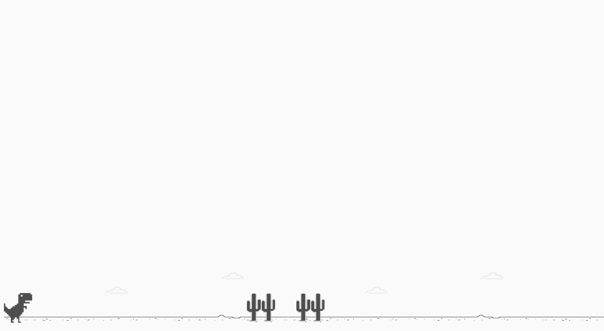

<h1>Dinosaur Game</h1>

Project provided by (DIO) Digital Innovation One. Javascript Developer Bootcamp

You may have seen this game if you already tried to use Google Chrome browser without internet connection. This Dino Game was the proposal for one of the courses presented in the **HTML Web Developer** bootcamp. Concepts about **CSS and Javascript** are covered in the course and emphasize the Game Development with Javascript.

You can go to my github [page](https://rvsriller.github.io/rierDinosaurGame/) and see how the first version of this game looks like :video_game: :video_game:

This project is for study purposes, all kinds of contributions are very welcome and appreciated!

# Tecnologies

HTML 5 | CSS 3 | Javascript ES 6
